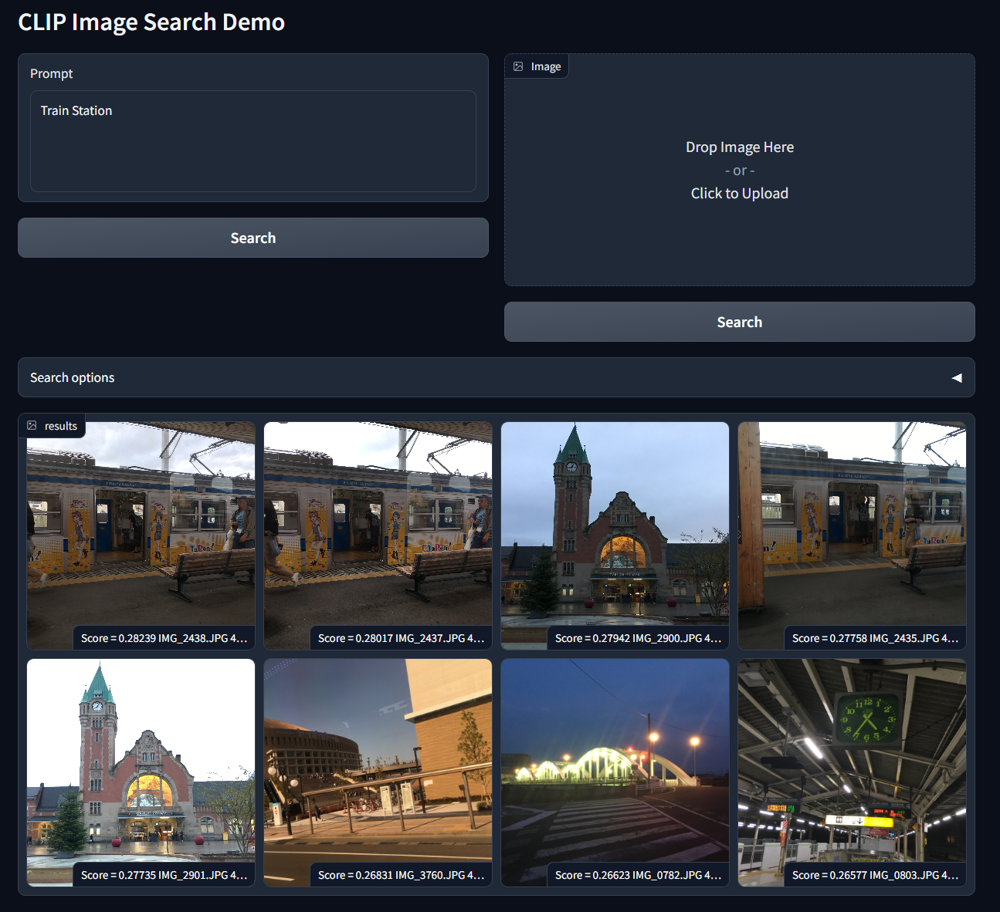
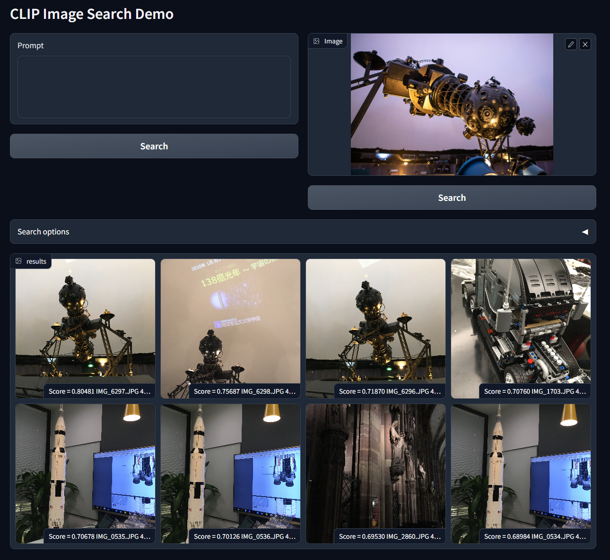

# clip-image-search
A simple image search engine using CLIP feature.

# Pre-requisites
We need python3, mongodb and [CLIP model library](https://github.com/openai/CLIP) to run this project.
## Python requirements 
```
pip3 install -r requirements.txt
```
## MongoDB Server
Start MongoDB server separately and save the address into `config.json` file.

You can also start a seperate MongoDB server by `start.sh` script in `mongo_sample` folder.

## CLIP Model 
Install CLIP python library by following the instruction in [openai/CLIP](https://github.com/openai/CLIP)

# Usage
There a two stages in this project. Make sure you have already started the MongoDB server.
## 1. Import images
There are two modes on importing images into database: `import` mode and `copy` mode.
`import` mode do not copy file, and you have to keep the original file later.
`copy` mode is useful when you need to scan temp or cache folder, and you can delete the original file after importing.
In both mode, the script will scan folder recursively and import all images files into database.

```
# import mode
python3 import_images.py /path/to/folder

# copy mode
python3 import_images.py /path/to/folder --copy
```

## 2. Start search engine 
```
python3 server.py
```

## 3. Search Images
### Search images by text



### Search by image:



# TODO
[ ] Test cases
[ ] Support for OCR text, using PaddleOCR
[ ] ElasticSearch for text search engine backend
[ ] Change to a vector database backend: Faiss
[ ] Import and search EXIF
[ ] Multi-language support for OCR model
[ ] Multi-language support for Text Search